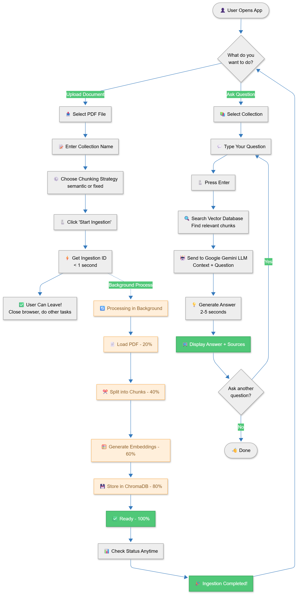

# Multi-Collection RAG Chatbot 🤖📚

A powerful Retrieval-Augmented Generation (RAG) chatbot with **multi-collection support**, allowing you to organize and query different document sets independently.

## ✨ Key Features

- 🗂️ **Multi-Collection Support** - Create unlimited collections for different topics/projects
- 🔍 **Intelligent Retrieval** - Semantic search using HuggingFace embeddings
- 💬 **Natural Conversations** - Powered by Google Gemini 2.5-Flash
- 📄 **Source Tracking** - View the exact chunks used to generate answers
- 🎨 **Modern UI** - Clean Streamlit interface with collection management
- 🚀 **FastAPI Backend** - RESTful API architecture for scalability
- 📊 **Semantic Chunking** - Context-aware document splitting
- 💾 **Persistent Storage** - ChromaDB vector database

## 🆕 What's New in v2.0

### Multi-Collection Architecture
- **Create separate collections** for different document sets
- **Independent context** per collection (no cross-contamination)
- **Easy switching** between collections via dropdown
- **Collection management** - create, query, list, delete

### Enhanced UI
- Collection selector in sidebar
- Collection info display (chunk counts)
- Collection-aware ingestion
- Visual feedback for active collection

### Improved API
- Collection-based endpoints
- List all collections with statistics
- Collection-specific querying
- Selective collection deletion
- **Background ingestion** with job tracking
- Chunking strategy selector (semantic/fixed)
- Real-time ingestion status updates

## 🚀 Quick Start

### Prerequisites
- Python 3.12+
- Virtual environment (recommended)

### Installation

1. Clone the repository:
```bash
git clone <repository-url>
cd chatbot-application-with-RAG
```

2. Create and activate virtual environment:
```bash
python -m venv .venv
.venv\Scripts\activate  # Windows
# or
source .venv/bin/activate  # Linux/Mac
```

3. Install dependencies:
```bash
pip install -r requirements.txt
```

4. Set up environment variables:
Create a `.env` file with your Google API key:
```
GOOGLE_API_KEY=your_api_key_here
```

### Running the Application

**Easy Method - Use Batch Scripts:**

1. **Start Backend:** Double-click `start_backend.bat`
2. **Start Frontend:** Double-click `start_frontend.bat`

**Manual Method:**

#### Step 1: Start FastAPI Backend
```bash
python -m uvicorn backend.api:app --reload --host 0.0.0.0 --port 8000
```
API will run on http://localhost:8000

#### Step 2: Start Streamlit UI
```bash
streamlit run frontend\app_api.py
```
UI will open at http://localhost:8501

**Legacy App (without API):**
```bash
streamlit run app\app.py
```

#### Step 3: Create Collections & Upload Documents
1. Go to **Ingestion** tab
2. Enter a collection name (e.g., "research_papers")
3. Choose chunking strategy (Semantic or Fixed-size)
4. Upload PDF file
5. Click **Ingest Document**
6. Ingestion runs in background - track status in UI
7. Wait 2-5 minutes for processing to complete

#### Step 4: Query Your Documents
1. Select collection from dropdown
2. Ask questions in the chat
3. Get answers with source chunks!

## 📁 Project Structure

```
chatbot-application-with-RAG/
├── backend/              # FastAPI backend
│   ├── api.py           # FastAPI endpoints & RAG system
│   ├── database.py      # SQLAlchemy models for job tracking
│   ├── ingest.py        # Document ingestion logic
│   └── query.py         # RAG query logic
├── frontend/            # Streamlit UI (API-based)
│   └── app_api.py       # Main Streamlit app with API calls
├── app/                 # Legacy standalone app
│   └── app.py           # Streamlit app without API
├── data/                # PDF documents (if any)
├── Vector_DB/           # ChromaDB storage (gitignored)
├── .venv/               # Virtual environment (gitignored)
├── requirements.txt     # Python dependencies
├── .env                 # Environment variables (gitignored)
├── start_backend.bat    # Quick start script for API
├── start_frontend.bat   # Quick start script for UI
└── README.md            # This file
```

## 🏗️ Architecture



## 🔧 Technology Stack

| Component | Technology |
|-----------|-----------|
| **Frontend** | Streamlit |
| **Backend** | FastAPI |
| **LLM** | Google Gemini 2.5-Flash |
| **Embeddings** | HuggingFace (all-mpnet-base-v2) |
| **Vector DB** | ChromaDB |
| **Chunking** | SemanticChunker + RecursiveCharacterTextSplitter |
| **Job Tracking** | SQLAlchemy + SQLite |

## 🎯 Use Cases

### Research Papers
- Collection: "ml_papers" - Machine Learning research
- Collection: "quantum_papers" - Quantum Computing papers
- Collection: "bio_papers" - Biology research

### Project Documentation
- Collection: "project_alpha" - Alpha project docs
- Collection: "project_beta" - Beta project docs
- Collection: "project_gamma" - Gamma project docs

### Multi-Domain Knowledge Base
- Collection: "technical_docs" - Technical documentation
- Collection: "business_docs" - Business documents
- Collection: "legal_docs" - Legal documents

## 🔌 API Endpoints

### GET /health
Check API health and database status

### GET /collections
List all collections with chunk counts

### POST /query
Query a specific collection
```json
{
  "question": "What is a transformer?",
  "collection_name": "research_papers"
}
```

### POST /ingest
Ingest PDF to collection (background processing)
```
Form Data:
- file: PDF file
- collection_name: "my_collection"
- chunking_strategy: "semantic" or "fixed"
Returns: {"ingestion_id": "uuid", "message": "..."}
```

### GET /status/{ingestion_id}
Check ingestion job status
```json
Response: {
  "status": "PROCESSING",
  "progress": 45.5,
  "message": "Processing document..."
}
```

### GET /ingestions
List recent ingestion jobs with status

### DELETE /database
Delete entire database or specific collection
```
Query Parameter:
- collection_name: "specific_collection" (optional)
```

## 🎨 UI Features

- **Collection Selector** - Dropdown to choose active collection
- **Chat Interface** - Multi-session chat history
- **Source Chunks** - Expandable view of retrieved context
- **Document Upload** - Drag-and-drop PDF ingestion
- **Collection Info** - Display chunk counts per collection
- **Session Management** - Create, switch, delete chat sessions

## 🛠️ Troubleshooting

### API Not Responding
- **Issue**: Streamlit shows connection errors
- **Solution**: Ensure FastAPI is running on http://localhost:8000
- **Check**: Run `curl http://localhost:8000/health` or visit in browser

### Collection Name Validation Error
- **Issue**: "Invalid collection name" error
- **Solution**: Use only alphanumeric characters, dots, underscores, hyphens
- **Valid**: `research_papers`, `my-docs`, `collection.v1`
- **Invalid**: `my docs` (space), `report ` (trailing space)

### Ingestion Fails with 500 Error
- **Issue**: Ingestion returns server error
- **Solution**: 
  - Check API logs for detailed error
  - Ensure PDF is valid and not corrupted
  - Verify collection name is properly formatted
  - Restart API if needed

### Empty Collections Appearing
- **Issue**: Default collection shows with 0 chunks
- **Solution**: This is fixed in latest version - only collections with documents are loaded

### Background Ingestion Stuck
- **Issue**: Ingestion status stays at "PROCESSING"
- **Solution**:
  - Check `/ingestions` endpoint for error details
  - Large PDFs may take 5-10 minutes
  - Restart API if truly stuck

## 📝 Collection Naming Rules

Collection names must:
- Be at least 3 characters long
- Start and end with alphanumeric characters
- Contain only: letters, numbers, dots (.), underscores (_), hyphens (-)
- **No spaces or trailing whitespace**

Examples:
✅ `research_papers_2024`
✅ `my-collection.v2`
✅ `project_alpha`
❌ `my collection` (space)
❌ `report ` (trailing space)
❌ `ab` (too short)

