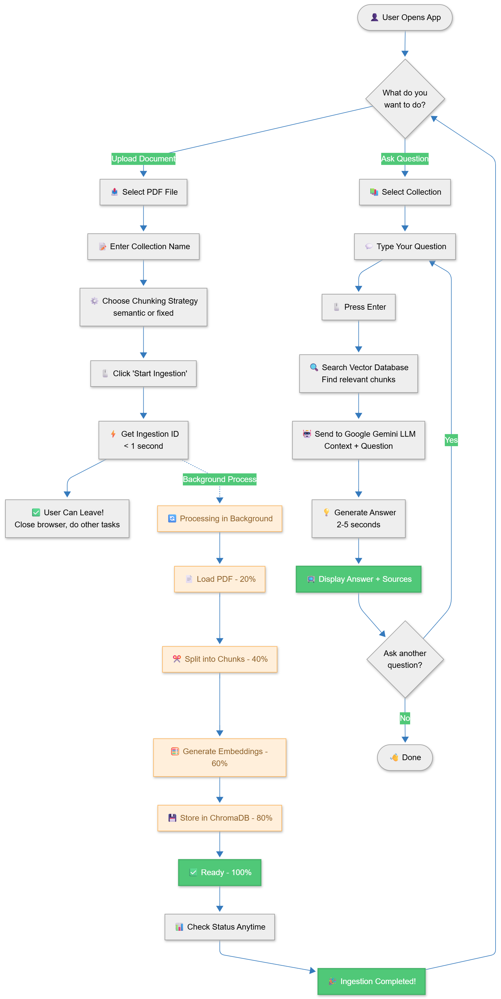
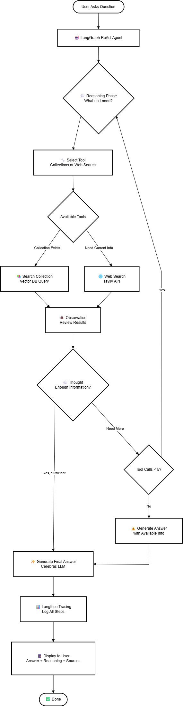
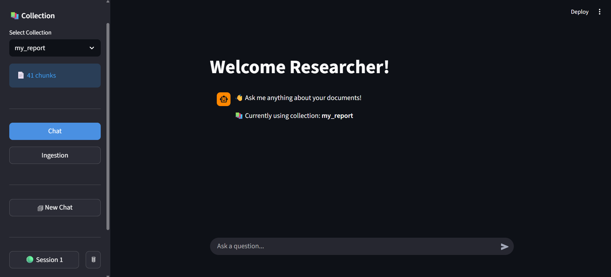
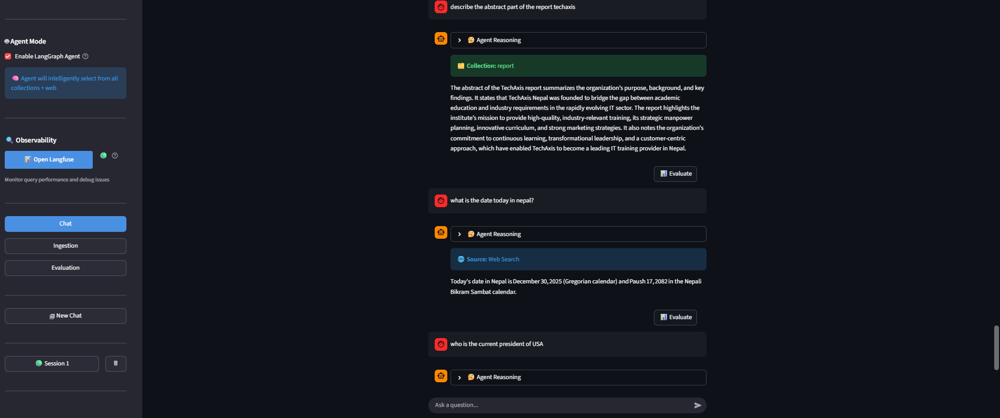
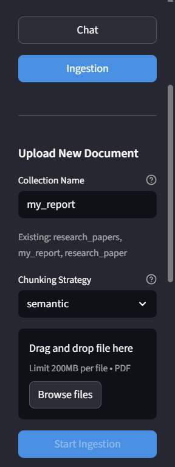

# chatbot-application-implementing-RAG

A powerful Retrieval-Augmented Generation (RAG) chatbot with **intelligent agent architecture**, multi-collection support, and web search capabilities for comprehensive question answering.

## Key Features

- **Intelligent ReAct Agent** - LangGraph-based agent with reasoning and tool selection
- **Multi-Collection Support** - Create unlimited collections for different topics/projects
- **Web Search Integration** - Tavily-powered web search for current information
- **Smart Tool Selection** - Agent automatically chooses between collections and web search
- **Intelligent Retrieval** - Semantic search using HuggingFace embeddings
- **Natural Conversations** - Powered by Cerebras GPT-OSS-120B
- **Reasoning Visibility** - See agent's thought process and tool usage
- **Source Tracking** - View exact chunks and sources used
- **Langfuse Tracing** - Full observability and performance monitoring
- **Modern UI** - Clean Streamlit interface with collection management
- **FastAPI Backend** - RESTful API architecture for scalability
- **Semantic Chunking** - Context-aware document splitting
- **Dual Storage** - ChromaDB + Qdrant for flexible querying

## What's New in v3.0

### LangGraph ReAct Agent
- **Autonomous reasoning** - Agent thinks step-by-step before acting
- **Multi-tool coordination** - Intelligently uses multiple tools if needed
- **Dynamic tool selection** - Chooses appropriate tool based on query
- **Reasoning trace** - View agent's thought process in UI:
  - **Action:** What tool the agent is calling
  - **Observation:** Results from tool execution
  - **Thought:** Agent's reasoning and conclusions

### Web Search Capability
- **Tavily integration** - High-quality web search optimized for LLM
- **Current information** - Access up-to-date information beyond your documents

### Enhanced Architecture
- **Qdrant vector database** - Dedicated agent knowledge base
- **Tool-based architecture** - Dynamic tool generation per collection
- **ReAct framework** - Reasoning + Acting for better decision making
- **Stopping conditions** - Smart limits prevent infinite loops

### Langfuse Observability
- **Full tracing** - Track every agent decision and LLM call
- **Performance metrics** - Token usage, latency, cost tracking
- **Debugging tools** - Understand agent behavior and optimize prompts

## Quick Start

### Prerequisites
- Python 3.12+
- Virtual environment (recommended)

### Installation

1. Clone the repository:
```bash
git clone <repository-url>
cd chatbot-application-with-RAG
```

2. Create and activate virtual environment:
```bash
python -m venv .venv
.venv\Scripts\activate  # Windows
# or
source .venv/bin/activate  # Linux/Mac
```

3. Install dependencies:
```bash
pip install -r requirements.txt
```

4. Set up environment variables:
Create a `.env` file with your API keys:
```env
# LLM API Key (Cerebras)
CEREBRAS_API_KEY=your_cerebras_key_here

# Web Search API Key (Tavily)
TAVILY_API_KEY=your_tavily_key_here

# Optional: Langfuse for tracing (local or cloud)
LANGFUSE_PUBLIC_KEY=pk-lf-...
LANGFUSE_SECRET_KEY=sk-lf-...
LANGFUSE_HOST=http://localhost:3000
```

**Getting API Keys:**
- **Cerebras**: Sign up at https://cerebras.ai/ for fast inference
- **Tavily**: Get free API key at https://tavily.com/
- **Langfuse**: Run locally with Docker or use cloud at https://langfuse.com/

### Running the Application

**Easy Method - Use Batch Scripts:**

1. **Start Backend:** Double-click `start_backend.bat`
2. **Start Frontend:** Double-click `start_frontend.bat`

**Manual Method:**

#### Step 1: Start FastAPI Backend
```bash
python -m uvicorn backend.api:app --reload --host 0.0.0.0 --port 8000
```
API will run on http://localhost:8000

#### Step 2: Start Streamlit UI
```bash
streamlit run frontend\app_api.py
```
UI will open at http://localhost:8501


**Two query modes:**

1. **Agent Mode (Recommended)** - Intelligent multi-tool agent
   - Automatically searches collections OR web as needed
   - Shows reasoning process
   - Coordinates multiple tools if required
   - Best for complex queries

2. **Direct RAG** - Simple collection search
   - Select specific collection from dropdown
   - Direct semantic search
   - Faster for simple lookups

**Using the Agent:**
1. Switch to **Agent Chat** tab
2. Ask any question - agent decides which tool to use
3. Watch the reasoning process in expandable section
4. View sources and get comprehensive answers

#### Step 3: Create Collections & Upload Documents
1. Go to **Ingestion** tab
2. Enter a collection name (e.g., "research_papers")
3. Choose chunking strategy (Semantic or Fixed)
4. Upload PDF document
5. Wait for ingestion to complete

## Project Structure

```
chatbot-application-with-RAG/
├── backend/             # FastAPI backend
│   ├── api.py           # FastAPI routes
│   ├── database.py      # SQLAlchemy models for job tracking
│   ├── ingest.py        # Document ingestion logic
│   ├── query.py         # RAG query logic & LLM setup
│   ├── agent.py         # Legacy agent implementation
│   ├── langgraph_agent.py  # LangGraph ReAct agent
│   ├── tools.py         # Dynamic tool generation
│   └── collection_manager.py  # Collection management
├── frontend/            # Streamlit UI (API-based)
│   └── app_api.py       # Main Streamlit app with agent support
├── experiments/         # Evaluation & testing
│   ├── evaluate_rag.py  # RAG evaluation
│   └── evaluate_answers.py  # Answer quality evaluation
├── app/                 # Legacy standalone app
│   └── app.py           # Streamlit app without API
├── data/                # PDF documents
├── Vector_DB/           # ChromaDB storage (gitignored)
├── Qdrant_DB/           # Qdrant storage for agent (gitignored)
├── .venv/               # Virtual environment (gitignored)
├── requirements.txt     # Python dependencies
├── .env                 # Environment variables (gitignored)
├── start_backend.bat    # Quick start script for API
├── start_frontend.bat   # Quick start script for UI
└── README.md            # This file
```

## Architecture

### System Architecture (Traditional RAG)


### Agent Architecture (LangGraph ReAct)
<!-- TODO: Add agent architecture diagram -->


### User Interface Screenshots
<!-- TODO: Update with agent UI screenshots -->


### Agent Reasoning Display
<!-- TODO: Add screenshot showing agent reasoning process -->


### Ingestion Interface


## Technology Stack

| Component | Technology |
|-----------|------------|
| **Frontend** | Streamlit |
| **Backend** | FastAPI |
| **Agent Framework** | LangGraph (ReAct pattern) |
| **LLM** | Cerebras GPT-OSS-120B |
| **Embeddings** | HuggingFace (all-mpnet-base-v2) |
| **Vector DB** | ChromaDB + Qdrant |
| **Web Search** | Tavily API |
| **Chunking** | SemanticChunker + RecursiveCharacterTextSplitter |
| **Observability** | Langfuse 3.x |
| **Job Tracking** | SQLAlchemy + SQLite |

## Use Cases

### Research Papers
- Collection: "ml_papers" - Machine Learning research
- Collection: "quantum_papers" - Quantum Computing papers
- Collection: "bio_papers" - Biology research

### Project Documentation
- Collection: "api_docs" - API documentation
- Collection: "user_guides" - User manuals

### Company Knowledge Base
- Collection: "hr_policies" - HR policies and procedures
- Collection: "tech_specs" - Technical specifications

## API Endpoints

### Agent Endpoints

#### POST /langgraph_agent_query
Query the intelligent agent (recommended)
```json
{
  "question": "What is the accuracy of TechBot?",
  "k": 5
}
```
Response includes:
- `answer`: Final agent response
- `reasoning_steps`: Array of agent's reasoning process
- `tools_used`: List of tools the agent called
- `trace_id`: Langfuse trace ID for debugging

### Traditional RAG Endpoints

#### GET /health
Check API health and database status

#### GET /collections
List all collections with chunk counts

#### POST /query
Query a specific collection (traditional RAG)
```json
{
  "question": "What is a transformer?",
  "collection_name": "research_papers",
  "k": 3
}
```

### Ingestion Endpoints

#### POST /ingest
Ingest PDF to collection (background processing)
```
Form Data:
- file: PDF file
- collection_name: "my_collection"
- chunking_strategy: "semantic" or "fixed"
Returns: {"ingestion_id": "uuid", "message": "..."}
```

#### GET /status/{ingestion_id}
Check ingestion job status
```json
Response: {
  "status": "PROCESSING",
  "progress": 45.5,
  "message": "Processing document..."
}
```

### Collection Management Endpoints

#### POST /collections/create
Create a new collection
```json
{
  "collection_name": "my_docs",
  "description": "My document collection"
}
```

#### GET /collections/list
List all available collections with metadata

#### GET /ingestions
List recent ingestion jobs with status

#### DELETE /database
Delete entire database or specific collection
```
Query Parameter:
- collection_name: "specific_collection" (optional)
```

## UI Features

- **Agent Chat** - Intelligent agent with reasoning display
- **Collection Chat** - Traditional RAG with collection selector
- **Reasoning Visibility** - Expandable agent thought process
- **Tool Usage Display** - See which tools agent used
- **Multi-Session Chat** - Multiple independent conversations
- **Source Chunks** - Expandable view of retrieved context
- **Document Upload** - Drag-and-drop PDF ingestion
- **Collection Info** - Display chunk counts per collection
- **Session Management** - Create, switch, delete chat sessions

## Agent Behavior

### How the Agent Works
- **ReAct Pattern**: Reasoning + Acting cycle
- **Tool Selection**: Chooses from available collection tools + web search
- **Autonomous Decisions**: No hardcoded priority - intelligent decision making
- **Multi-Tool Usage**: Can use multiple tools if needed for comprehensive answer
- **Reasoning Trace**: Displays thought process, actions, and observations

## Troubleshooting

### Agent Issues

#### Agent Not Responding
- **Issue**: Agent query times out or fails
- **Solution**: 
  - Check Cerebras API key is valid
  - Verify backend logs for errors
  - Ensure collections have ingested data
  - Restart backend if needed

#### Agent Uses Wrong Tool
- **Issue**: Agent searches web when answer is in collections
- **Solution**: 
  - This is normal - agent makes autonomous decisions
  - Agent may use web for verification or additional context
  - Check if collection description is clear and informative
  - Verify collection actually contains relevant information

#### Reasoning Steps Not Showing
- **Issue**: Agent answer appears but no reasoning visible
- **Solution**:
  - Expand "Agent Reasoning" section in UI
  - Check that agent completed successfully (not errored)
  - Verify backend is returning `reasoning_steps` in response

### API Issues

#### API Not Responding
- **Issue**: Streamlit shows connection errors
- **Solution**: Ensure FastAPI is running on http://localhost:8000
- **Check**: Run `curl http://localhost:8000/health` or visit in browser

#### Web Search Fails
- **Issue**: Agent errors when trying web search
- **Solution**:
  - Verify Tavily API key in `.env` file
  - Check API key has remaining credits
  - Test: `curl https://api.tavily.com/search` with your key

#### Langfuse Not Tracking
- **Issue**: No traces appearing in Langfuse
- **Solution**:
  - Check Langfuse server is running (if local)
  - Verify LANGFUSE_PUBLIC_KEY and LANGFUSE_SECRET_KEY in `.env`
  - Check backend logs for Langfuse connection errors
  - Traces are optional - agent works without them

### Ingestion Issues

#### Collection Name Validation Error
- **Issue**: "Invalid collection name" error
- **Solution**: Use only alphanumeric characters, dots, underscores, hyphens
- **Valid**: `research_papers`, `my-docs`, `collection.v1`
- **Invalid**: `my docs` (space), `report ` (trailing space)

#### Ingestion Fails with 500 Error
- **Issue**: Ingestion returns server error
- **Solution**: 
  - Check API logs for detailed error
  - Ensure PDF is valid and not corrupted
  - Verify collection name is properly formatted
  - Restart API if needed

### Database Issues

#### Empty Collections Appearing
- **Issue**: Default collection shows with 0 chunks
- **Solution**: This is fixed in latest version - only collections with documents are loaded

### Background Ingestion Stuck
- **Issue**: Ingestion status stays at "PROCESSING"
- **Solution**:
  - Check `/ingestions` endpoint for error details
  - Large PDFs may take 5-10 minutes
  - Restart API if truly stuck

## Collection Naming Rules

Collection names must:
- Be at least 3 characters long
- Start and end with alphanumeric characters
- Contain only: letters, numbers, dots (.), underscores (_), hyphens (-)
- **No spaces or trailing whitespace**

Examples:
- Valid: `research_papers_2024` 
- Valid: `my-collection.v2` 
- Valid: `project_alpha` 
- Invalid: `my collection` (space) 
- Invalid: `report ` (trailing space) 
- Invalid: `ab` (too short)

